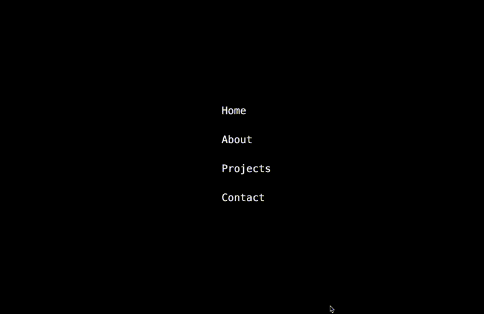

# 🔤 Alphabet Hover Navigation ✨


A creative navigation component for React that animates text through the alphabet when hovered. Each character in the navigation item cycles through all 26 letters of the alphabet in sequence, creating a dynamic and eye-catching effect!

## 🎬 Demo


[Live Demo](https://alphabet-hover-nav-a113146cee37.herokuapp.com/)

## ✨ Features

- 🔤 Character-by-character animation through the entire alphabet
- ⏱️ Customizable animation speed and timing
- 🔄 Left-to-right sequential animation
- 🎨 Clean minimalist black & white design
- 📱 Responsive layout

## 🚀 Quick Start

### Installation

```bash
# Clone this repository
git clone https://github.com/yourusername/alphabet-hover-nav.git
cd alphabet-hover-nav

# Install dependencies
npm install
```

### Development

```bash
# Start development server
npm start
```

Visit `http://localhost:3000` to see the app in action.

### Building for Production

```bash
# Build the app
npm run build
```

## 🛠️ Customization

### Navigation Items

Edit the `navItems` array in the `AlphabetHoverNav` component:

```jsx
const navItems = ['Home', 'About', 'Projects', 'Contact', 'Your New Item'];
```

### Animation Settings

Adjust the animation parameters in the `AlphabetLink` component:

```jsx
// Animation speed (milliseconds per letter change)
const animationSpeed = 30; 

// Delay between starting animation for each character (milliseconds)
const characterDelay = 100; 
```

## 🌐 Deployment to Heroku

### Prerequisites

- [Heroku CLI](https://devcenter.heroku.com/articles/heroku-cli) installed
- Heroku account

### Deployment Steps

1. Login to Heroku:

```bash
heroku login
```

2. Create a new Heroku app:

```bash
heroku create alphabet-hover-nav
```

3. Initialize Git (if you haven't already):

```bash
git init
git add .
git commit -m "Initial commit"
```

4. Push to Heroku:

```bash
git push heroku main
```

5. Open your deployed app:

```bash
heroku open
```

## 🔍 Troubleshooting

If you encounter any issues with the deployment:

- Check Heroku logs: `heroku logs --tail`
- Make sure you've committed all changes before pushing
- Verify your Node.js version in package.json is compatible with Heroku

## 🤝 Contributing

Contributions, issues, and feature requests are welcome! Feel free to check the [issues page](#).

## 📝 License

Distributed under the MIT License. See `LICENSE` for more information.

## 🙏 Acknowledgments

- Inspired by creative typography animations
- Built with [Create React App](https://create-react-app.dev/)
- Styled with [Tailwind CSS](https://tailwindcss.com/)

---

Made with ❤️ by [Ben](#)